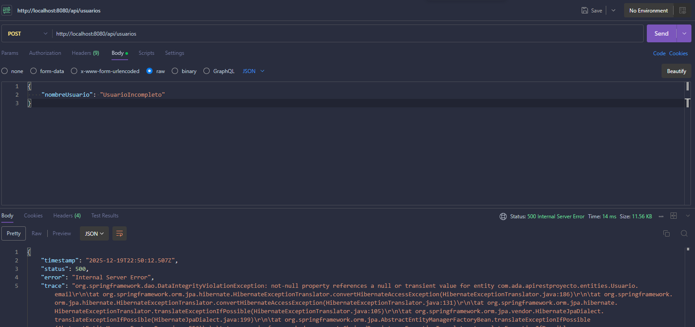
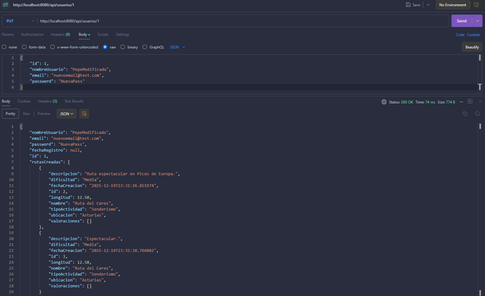
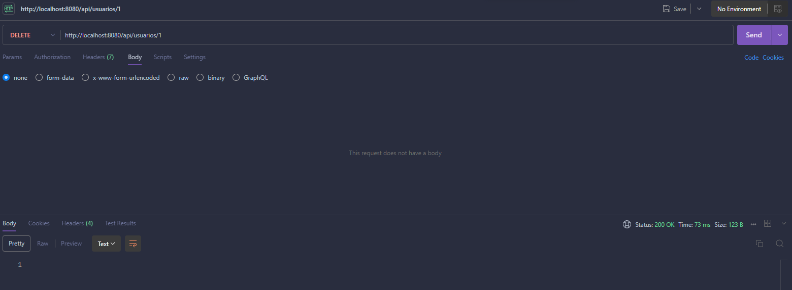
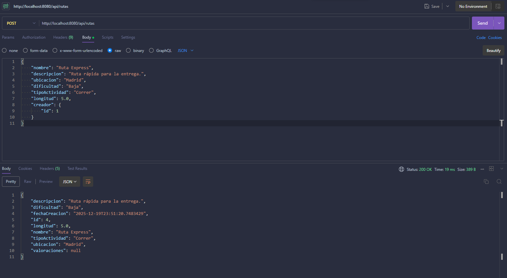
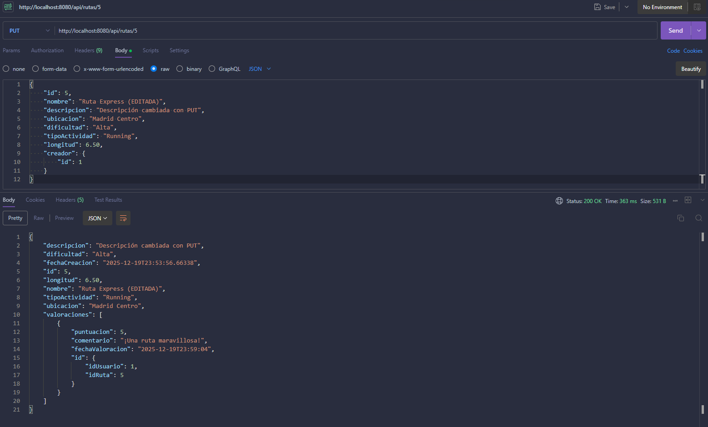
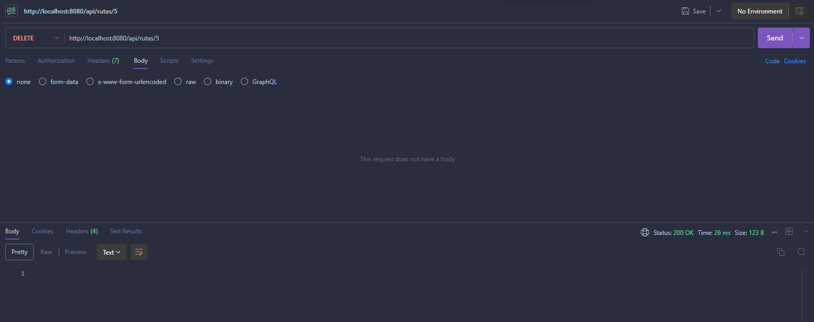
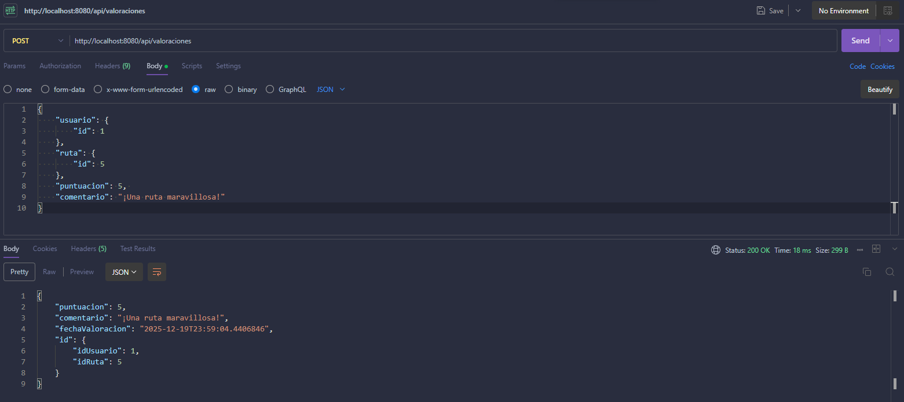

# Documentación de Pruebas API REST - Proyecto UD2

Este documento recoge las pruebas realizadas con Postman para verificar el funcionamiento de la API REST implementada con Spring Boot. La API gestiona tres tablas conectadas: **Usuario**, **Ruta** y **Valoración**.

## 1. Gestión de la Recursividad JSON
Para cumplir con el requisito de evitar problemas de recursividad infinita en las relaciones bidireccionales (Usuario <-> Ruta <-> Valoración), se han implementado las siguientes anotaciones de Jackson en las entidades:

* **@JsonManagedReference:** Se ha colocado en la parte "padre" de la relación (Usuario y Ruta) para indicar que esta parte debe ser serializada.
* **@JsonBackReference:** Se ha colocado en la parte "hija" (Ruta y Valoración) para evitar que se vuelva a serializar al padre, cortando así el bucle infinito.

## 2. Pruebas de la Entidad: USUARIO (/api/usuarios)

### 2.1. Crear Usuario (POST)
Se verifica la inserción correcta de un nuevo usuario en la base de datos.
**Ruta:** `POST /api/usuarios`

### 2.2. Gestión de Errores en Creación (POST)
Se valida que la API devuelve un error (500/400) cuando se intentan insertar datos incompletos o inválidos.
**Ruta:** `POST /api/usuarios`

### 2.3. Actualizar Usuario (PUT)
Se modifica un usuario existente buscando por su ID.
**Ruta:** `PUT /api/usuarios/{id}`

### 2.4. Eliminar Usuario (DELETE)
Se elimina un usuario y, en cascada, sus rutas y valoraciones asociadas.
**Ruta:** `DELETE /api/usuarios/{id}`

## 3. Pruebas de la Entidad: RUTA (/api/rutas)

### 3.1. Crear Ruta (POST)
Se crea una ruta asignándola a un Usuario existente (ID 1). Se comprueba que se genera el ID autonumérico correctamente.
**Ruta:** `POST /api/rutas`

### 3.2. Gestión de Errores en Ruta (POST)
Prueba de validación donde se intenta crear una ruta sin asignar un "Creador" o con datos obligatorios faltantes.
**Ruta:** `POST /api/rutas`

### 3.3. Actualizar Ruta (PUT)
Se actualizan los detalles de una ruta existente (ID 5).
**Ruta:** `PUT /api/rutas/{id}`

### 3.4. Eliminar Ruta (DELETE)
Se elimina una ruta específica de la base de datos.
**Ruta:** `DELETE /api/rutas/{id}`

## 4. Pruebas de la Entidad: VALORACIÓN (/api/valoraciones)

### 4.1. Crear Valoración (POST)
Se crea una valoración vinculando un Usuario (ID 1) y una Ruta (ID 5). Se valida que la puntuación esté dentro de los límites permitidos (Constraint Check).
**Ruta:** `POST /api/valoraciones`

### 4.2. Eliminar Valoración (DELETE)
Dado que la valoración tiene una clave primaria compuesta, se eliminan utilizando parámetros en la URL.
**Ruta:** `DELETE /api/valoraciones?idUsuario={id}&idRuta={id}`

